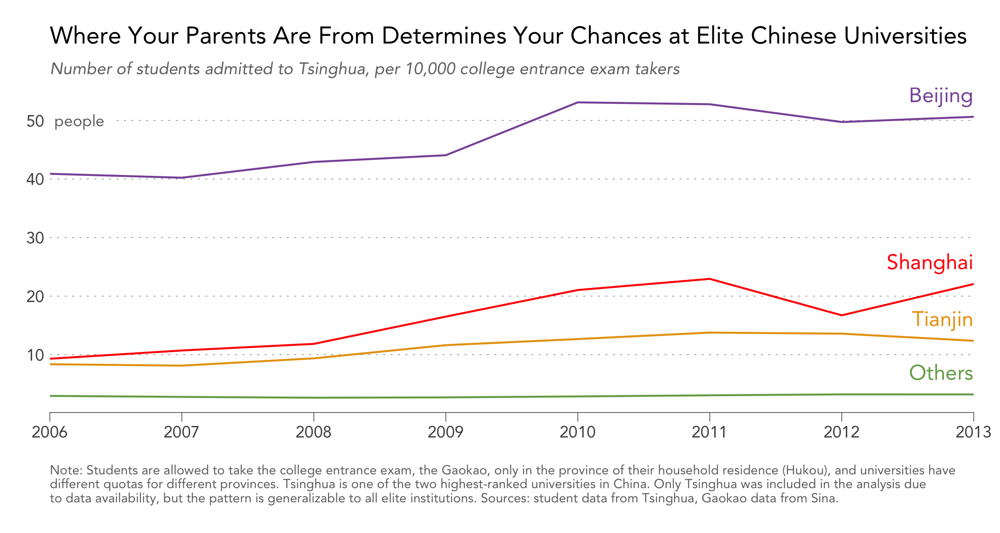
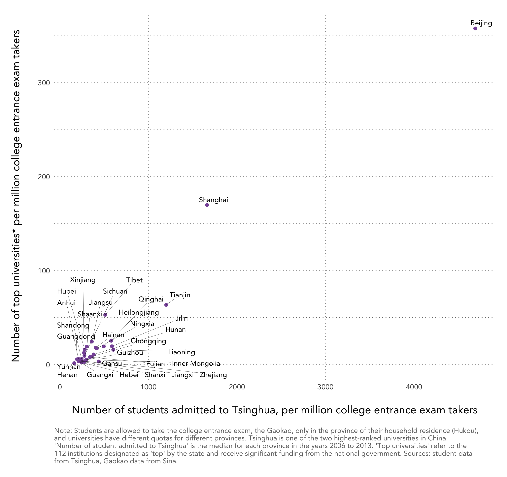
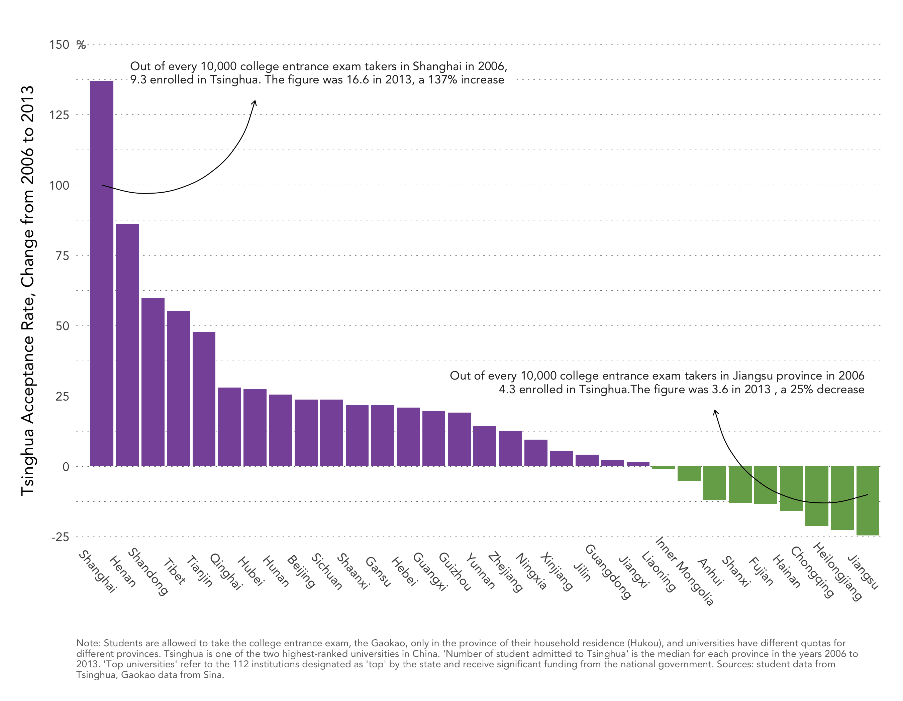

# Where your parents are from determine your chances at elite Chinese universities
The dataset and code here form the background of [this article](http://www.theatlantic.com/china/archive/2013/06/chinas-unfair-college-admissions-system/276995/) I wrote for the Atlantic  as well as [a blog post](https://www.zhihu.com/question/21572307/answer/77268293) I wrote in Chinese, which has garnered over 200k views and 2k comments. Please feel free to read either piece before proceeding with the code.

# Code
Requires packages data.table and plyr for data manipulation, ggplot2, ggrepel, rgeos, and sp for visualization.

# Data
- master.csv is the anonymized student roster of Tsinghua, which is arguably China's most prestigious university
- province.csv has data on the number college entrance exam takers by year and province
- univ211.csv has data on the number of "Project 211 Universities," which are those designated as "top institutions" by the Chinese government and receive significant state-level funding

# Charts
The following charts can be reproduced from the code and data supplied.

